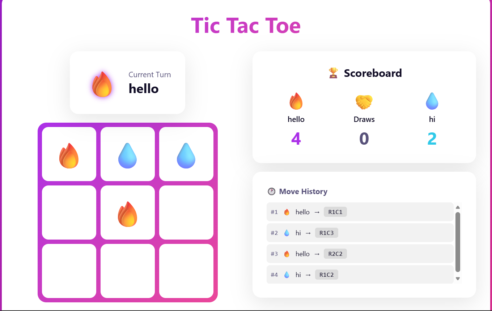

# 🎮 Tic Tac Toe Game

A modern, interactive Tic Tac Toe game built using **HTML, CSS, and JavaScript** with animations, sound effects, emoji-based players, score tracking, and move history.

---

## 🔥 Features

- ✅ Two-player mode (Player vs Player)
- ✅ Custom player names & emoji selection
- ✅ Sound effects for clicks, wins & undo
- ✅ Smooth animations & modern UI
- ✅ Scoreboard with local storage support
- ✅ Undo move feature
- ✅ Game reset & new game options
- ✅ Move history tracking
- ✅ Confetti celebration on win
- ✅ Responsive design for mobile & desktop

---

## 🛠️ Technologies Used

- HTML5  
- CSS3 (Animations, Grid, Flexbox)  
- JavaScript (DOM Manipulation, Local Storage, Audio API)

---

## 📸 Screenshots

  
  
  

---

## 🚀 How to Run the Project

1. Download or clone this repository  
2. Open the `index.html` file in your browser  
3. Enter player names  
4. Click **Start Game**  
5. Enjoy playing 🎮  

---

## 📂 Project Structure
tic-tac-toe-game/
└── code/
    ├── index.html
    ├── style.css
    ├── script.js
    ├── README.md
    └── assets/
---

## 👩‍💻 Author

**Sanikommu Deekshitha**  
Final Year Computer Science Student  
GitHub:https://github.com/deekshi122005/tic_tac_toe-pro-game

---

## ⭐ If you like this project, give it a star!
